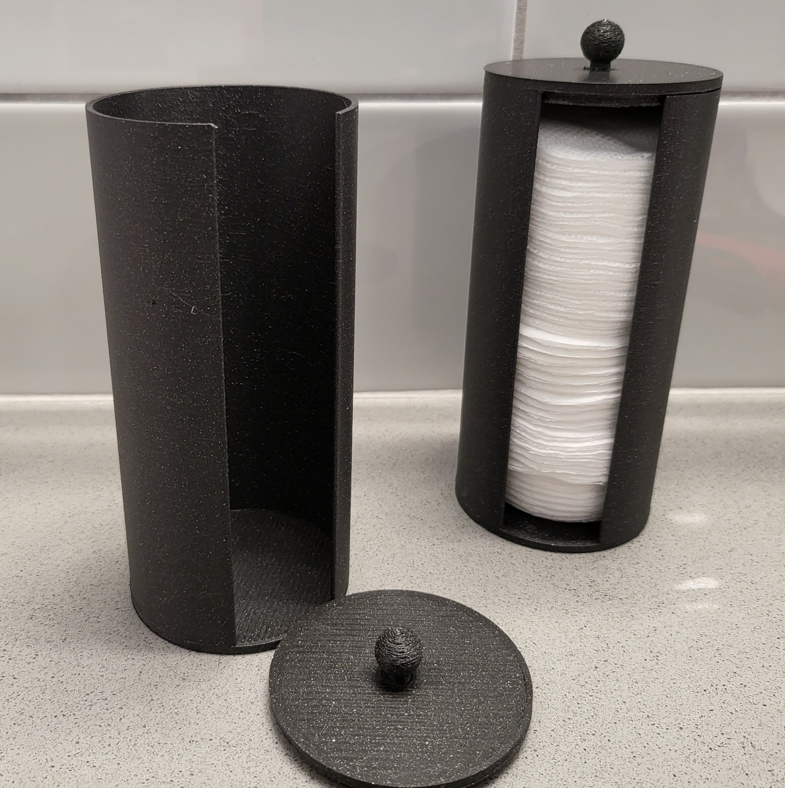

# Cotton holder/dispenser

The cotton "pads" have a diameter of 55mm. there is a 3mm gap on each side, so 61mm and down should fit without issue.

Multiple versions of the lid are available. You will probably have to trim the handle stub a little if your printer isn't super accurate. I "press fit" mine by turning and pushing, but you can always glue it in. I recommend a lot of walls/high infill for the handle.

I printed the holder part using vase mode with a 0.8mm nozzle and "40" bottom layers making the bottom ~3mm solid.

You do not need to use vase mode.

The lid and handle were also printed with a 0.8mm nozzle

if you print the lid and handle as separate parts you can avoid using supports

You can print this with basically any setting and any nozzle size. I used 0.8 instead of 0.4 to make the vase mode stronger, and the print faster. I would recomend going high-infill for the base just so that there is a little more weight, but you could also stick a heavy washer on the bottom if you think it's too light. 

